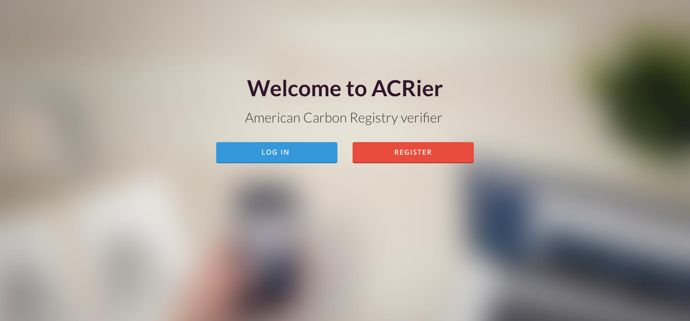

# ACRier (Hub Culture Hackathon)
ACRier is an American Carbon Registry verifier. It is a web application equipped with an android mobile application that provides a simple system for farmers and other industries to monitor their carbon emissions levels, but most importantly streamlines the auditing process removing the need to hire an auditor.

# Web Application
Farmers use this platform to sign up through a quick an easy method using a HubId and begin to quickly analyze their fields. Using Google Maps API they can additionally create a new project, create a report for their project, and view their recent reports. 

# Mobile Application
Farmers can upload the necessary data files for auditing/verification on the mobile app such as: fertilizer yield, soil moisture readings, and official documents for the auditor with their phones if they happen to be on site. Additionally this is a scrollview so if you scroll down they can also take pictures of their fields during flooding and drying periods.

# Set Up/ Contribute
There are three main folders the front-end, back-end, and android. Each contains the different parts of this project. To get
it up and running set up the server/database from the back-end, open up the front-end and look for the welcome.html file and this is what you're going to want up on a server. The android app can be made to communicate with the the front-end with a ittle hacking on your end. Happy forking! More about this hackathon/project below:

[About this Hackathon](https://www.eventbrite.com/e/hub-culture-hack-climate-identity-finance-tickets-27193464384?utm_source=eb_email&utm_medium=email&utm_campaign=event_reminder&utm_term=eventname#)

## Challenges
 1. Climate
 2. Finance
 3. Identity

API's/Documentation
---

- Google Maps API
- HubId API
